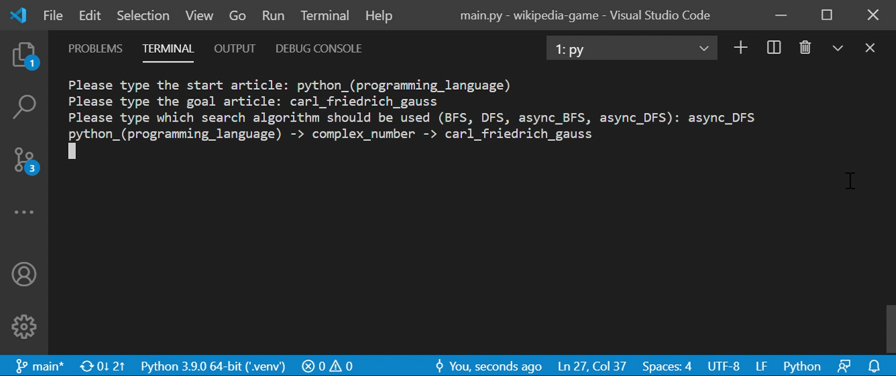

# wikipedia-game
How fast can you navigate from a *start* article to a *goal* article in Wikipedia?  
Given a *start* article, you can only advance by clicking on the links to other Wikipedia articles, within the article itself.

### Example
starting from the [Python (programming language) Wikipedia article](https://en.wikipedia.org/wiki/Python_(programming_language)), navigate to the [Carl Friedrich Gauss Wikipedia article](https://en.wikipedia.org/wiki/Carl_Friedrich_Gauss).

Few possible answers:
- [Python (programming language)](https://en.wikipedia.org/wiki/Python_(programming_language)) -> [Factorial](https://en.wikipedia.org/wiki/Factorial) -> [Carl Friedrich Gauss](https://en.wikipedia.org/wiki/Carl_Friedrich_Gauss)
- [Python (programming language)](https://en.wikipedia.org/wiki/Python_(programming_language)) -> [Complex number](https://en.wikipedia.org/wiki/Complex_number) -> [Carl Friedrich Gauss](https://en.wikipedia.org/wiki/Carl_Friedrich_Gauss)
- [Python (programming language)](https://en.wikipedia.org/wiki/Python_(programming_language)) -> [Number Theory](https://en.wikipedia.org/wiki/Number_theory) -> [Mathematics](https://en.wikipedia.org/wiki/Mathematics) -> [Carl Friedrich Gauss](https://en.wikipedia.org/wiki/Carl_Friedrich_Gauss)

## This Project
Given a *start* and *goal* articles provided by the user, the code in this project uses the [BFS](https://en.wikipedia.org/wiki/Breadth-first_search) or the [DFS](https://en.wikipedia.org/wiki/Depth-first_search) algorithms in order to find a solution path from the *start* to the *goal* articles, following the instructions above.

**The whole code is written in Python.**

**Notes:**
1. There may be more than one possible path.
2. BFS will always find the shortest path (in regards to the number of 'jumps' from one article to another).
3. Since Wikipedia is huge and the search can take a lot of time, two changeable restrictions are applied:
    1. The amount of articles that will be processed in total, see `MAX_ARTICLES_TO_SEARCH` in `main.py`
    2. The maximum length of a possible path from the *start* to *goal* articles, see `MAX_WIKI_PATH_LENGTH` in `main.py`.

## How to Run
1. This project was created and testsed with **Python 3.9**.
2. Create a Python Virtual Environment ('.venv'): `python -m venv .venv`
3. Install requirements: `pip install -r requirements.txt -y`
4. Run `main.py` file - in the command line execute `py main.py`.
5. Choose the *start* and *goal* articles.
6. Choose which search algorithm should be used.
7. The output may be empty if:
    1. A possible solution path does not exist.
    2. All of the possible solutions are longer than `MAX_WIKI_PATH_LENGTH`.
    3. The `MAX_ARTICLES_TO_SEARCH` bound was reached and the articles that were processed can not form a possible solution path. 

## Issues:
1. Time:  
    The search alogorithms (BFS / DFS) fetch articles from Wikipedia and process them.  
    Given the *start* and *goal* articles, as more and more articles are being fetched and processed, the response time from Wikipedia gets longer: From 0.5 seconds per one fetch up to 2 minutes and more!  
    This affects significantly on the total run time. One search with a possible solution of two 'jumps' can take a lot of precious minutes.  
    As a solution, I added 'async' fetching versions to BFS and DFS. These versions perform better than the not-async versions, yet the total time can still take minutes.

2. Semantics:  
    During the search, the different links within an article are not processed in a semantic way. We can reduce the search time if more semantically related links (articles) to the *goal* article were processed first. 
    